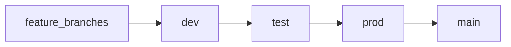

# ExpoGallery

## Workflow Badges


A comprehensive gallery showcasing Expo and React Native features, components, and API capabilities. This project serves as both a reference and demonstration of what's possible with Expo.

## Features

- **UI Components**: Various examples of React Native and Expo UI components
- **Device APIs**: Examples of location, notifications, secure storage, and more
- **Maps Integration**: Map displays with custom pins and location services
- **Chat Functionality**: Implementations using Gifted Chat and Chatty
- **Speech Services**: Text-to-speech and speech recognition examples
- **Storage Solutions**: Local, secure, and remote storage demonstrations
- **And more!**: Asset management, cryptography, device info, and many others

## Installation

1. Clone the repository:
   ```
   git clone https://github.com/coxcu/ExpoGallery.git
   cd ExpoGallery
   ```

2. Install dependencies:
   ```
   npx expo install
   ```

3. Set up environment variables:
   - Copy `.env.example` to `.env.local`
   - Fill in any required API keys

## Usage

Start the development server:
```
npx expo start
```

This will open the Expo Developer Tools in your browser. From there you can:
- Run on iOS simulator: Press `i`
- Run on Android emulator: Press `a`
- Run on web: Press `w`
- Scan QR code with Expo Go app on your physical device

## Project Structure

- [`/app`](/ExpoGallery/app): Main application screens and examples
- [`/components`](/ExpoGallery/components): Reusable UI components
- [`/assets`](/ExpoGallery/assets): Images, fonts, and other static resources
- [`/services`](/ExpoGallery/services): API and service integrations
- [`/hooks`](/ExpoGallery/hooks): Custom React hooks
- [`/utils`](/ExpoGallery/utils): Utility functions
- [`/storage`](/ExpoGallery/storage): Storage-related functionality

## Automated Deployments & Previews

This project utilizes GitHub Actions for automated testing, building, and deployment to GitHub Pages and Firebase Hosting.

### Deployment Triggers and Conditions

All automated deployments are contingent upon the successful completion of build processes and automated tests. If tests or the build fail, deployment will not proceed.

### GitHub Pages

*   **Target**: Serves the web version of the application.
*   **Triggered by**:
    *   Pushes (or merges) to the `main` branch.
    *   Pull Requests targeting the `main` branch.
*   **URL**: [https://curtcox.github.io/ExpoGallery/](https://curtcox.github.io/ExpoGallery/) (Note: This is the general GitHub Pages URL structure; the actual live URL might be different if a custom domain is configured or if it's hosted under a specific path).
*   **Workflow**: `deploy-expo-web.yml`

### Firebase Hosting

*   **Live Channel**:
    *   **Purpose**: Production deployment.
    *   **Triggered by**: Pushes (or merges) to the `main` branch.
    *   **URL**: [https://mapchatai.web.app](https://mapchatai.web.app)
    *   **Channel ID**: `live`

*   **Branch Preview Channels**:
    *   **Purpose**: Preview deployments for feature branches.
    *   **Triggered by**: Pushes to any branch *other than* `main`.
    *   **URL**: `https://mapchatai--preview-<sanitized-branch-name>.web.app` (e.g., `https://mapchatai--preview-dev.web.app` for the `dev` branch).
    *   **Channel ID**: `preview-<sanitized-branch-name>`

*   **Pull Request Preview Channels**:
    *   **Purpose**: Preview deployments for active Pull Requests.
    *   **Triggered by**: Opening or updating a Pull Request (targeting any branch).
    *   **URL**: `https://mapchatai--preview-pr-<pr-number>.web.app` (e.g., `https://mapchatai--preview-pr-123.web.app` for PR #123).
    *   **Channel ID**: `preview-pr-<pr-number>`

*   **Workflow**: `deploy-firebase.yml`

### Manual Deployments

Deployments can also be triggered manually:

*   **GitHub Pages (main branch)**: Navigate to Actions > `Deploy Expo Web to GitHub Pages` > Run workflow.
*   **Firebase Hosting (any branch)**: Navigate to Actions > `Deploy to Firebase Hosting` > Run workflow. You will be prompted to enter the branch name you wish to deploy.

## Development Tools

- `npx expo start`: Start the development server
- `npx expo install`: Install dependencies with Expo compatibility
- `yarn add expo`: Add Expo to the project
- `sudo xcode-select -s /Applications/Xcode.app/Contents/Developer`: Set Xcode developer directory
- `npm install expo-speech-recognition`: Example of adding a specific Expo package

## Branching Strategy

This project follows a specific branching strategy to ensure code quality and stability:

- `main` only accepts Pull Requests (PRs) from `prod`.
- `prod` only accepts PRs from `test`.
- `test` only accepts PRs from `dev`.
- `dev` can accept PRs from feature branches.

This flow ensures that code is thoroughly tested and reviewed before it reaches the `main` branch.



## License

This software, having considered all its options, has enthusiastically decided to free itself from all constraints and wander cheerfully into the public domain.
This means you're entirely welcome—encouraged even—to copy, modify, distribute, compile, sell, or otherwise play with it as suits your mood or practical needs,
be they commercial, non-commercial, or purely recreational.

Should you reside in a jurisdiction where copyright laws stubbornly exist, the authors, with a generous yet slightly bewildered shrug and muttered apologies to their future descendants who may one day lament at dinner parties about how their ancestors thoughtlessly squandered potential fortunes, hereby release all copyright claims, past, present, and future, into the hands of the general public. We do this with joyful abandon, primarily to irritate our future heirs and legal representatives who might otherwise dream wistfully of profits they shall never see.

It should be clearly noted, though not necessarily taken seriously, that the software comes entirely "as is." No warranty—implied, explicit, or whispered conspiratorially—is offered concerning merchantability, fitness for any specific purpose, or indeed basic safety.
Should anything peculiar, alarming, or peculiarly alarming, such as spontaneously evolving consciousness, developing strong opinions about interior design, or unexpectedly summoning the expressed written permission of Major League Baseball, you alone shall bear responsibility for managing the ensuing chaos or acclaim.

In short, feel completely free to use this software in whatever delightful, bizarre, or perfectly ordinary ways occur to you. But remember, whatever happens next is entirely your own affair.

Further details, if you insist, can be found at https://unlicense.org/.